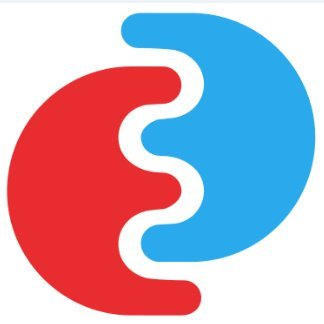

<!--
***
*** To avoid retyping too much info. Do a search and replace for the following:
*** template-svce, twitter_handle, email
-->

<!-- PROJECT SHIELDS -->
<!--
*** See the bottom of this document for the declaration of the reference variables
*** for contributors-url, forks-url, etc. This is an optional, concise syntax you may use.
*** https://www.markdownguide.org/basic-syntax/#reference-style-links
-->

[![Contributors][contributors-shield]][contributors-url]
[![Forks][forks-shield]][forks-url]
[![Stargazers][stars-shield]][stars-url]
[![Issues][issues-shield]][issues-url]
[![MIT License][license-shield]][license-url]
![Build][build-shield]

<!-- PROJECT LOGO -->
<br />
<p align="center">
  <a href="https://github.com/EOEPCA/template-svce">
    
  </a>

  <h3 align="center">template-service</h3>

  <p align="center">
    Template for developing an EOEPCA Service
    <br />
    <a href="https://github.com/EOEPCA/template-svce"><strong>Explore the docs »</strong></a>
    <br />
    <a href="https://github.com/EOEPCA/template-svce">View Demo</a>
    ·
    <a href="https://github.com/EOEPCA/template-svce/issues">Report Bug</a>
    ·
    <a href="https://github.com/EOEPCA/template-svce/issues">Request Feature</a>
  </p>
</p>

<!-- TABLE OF CONTENTS -->

## Table of Contents

- [About the Project](#about-the-project)
  - [Built With](#built-with)
- [Getting Started](#getting-started)
  - [Prerequisites](#prerequisites)
  - [Installation](#installation)
  - [Testing](#testing)
- [Documentation](#documentation)
- [Usage](#usage)
- [Roadmap](#roadmap)
- [Contributing](#contributing)
- [License](#license)
- [Contact](#contact)
- [Acknowledgements](#acknowledgements)

<!-- ABOUT THE PROJECT -->

## About The Project

[![Product Name Screen Shot][product-screenshot]](https://example.com)

Here's a blank template to get started:
**To avoid retyping too much info. Do a search and replace with your text editor for the following:**
`template-svce`, `twitter_handle`, `email`

### Built With

- [Javalin framework](https://javalin.io/)
- [Log4j2](https://logging.apache.org/log4j/2.x/) + [YAML](https://yaml.org/)
- [Junit 5](https://junit.org/junit5/)

<!-- GETTING STARTED -->

## Getting Started

To get a local copy up and running follow these simple steps.

### Prerequisites

This is an example of how to list things you need to use the software and how to install them.

- [Vagrant](https://www.vagrantup.com/docs/installation/)
- [EOEPCA Development Environment](https://github.com/EOEPCA/dev-env)

### Installation

1. Get into EOEPCA's development environment

```sh
vagrant ssh
```

3. Clone the repo

```sh
git clone https://github.com/EOEPCA/template-svce.git
```

4. Change local directory

```sh
cd template-service
```

### Testing

- `./gradlew build` runs only the unit tests
- `./gradlew integrationTest` runs only the integration tests (it compiles all source code beforehand). It does not package or deploy a build.
  This is assumed to have been done in a prior build pipeline step.

## Documentation

The component documentation can be found at https://eoepca.github.io/template-svce/.

<!-- USAGE EXAMPLES -->

## Usage

Use this space to show useful examples of how a project can be used. Additional screenshots, code examples and demos work well in this space. You may also link to more resources.

_For more examples, please refer to the [Documentation](https://example.com)_

### Running the template service

Just execute the run task in Gradle

```sh
./gradlew run
```

### Upgrading Gradle Wrapper

Change the version number in the `build.gradle` wrapper task then run:

```sh
./gradlew wrapper --gradle-version=4.10.2 --distribution-type=bin
```

<!-- ROADMAP -->

## Roadmap

See the [open issues](https://github.com/EOEPCA/template-svce/issues) for a list of proposed features (and known issues).

<!-- CONTRIBUTING -->

## Contributing

Contributions are what make the open source community such an amazing place to be learn, inspire, and create. Any contributions you make are **greatly appreciated**.

1. Fork the Project
2. Create your Feature Branch (`git checkout -b feature/AmazingFeature`)
3. Commit your Changes (`git commit -m 'Add some AmazingFeature'`)
4. Push to the Branch (`git push origin feature/AmazingFeature`)
5. Open a Pull Request

<!-- LICENSE -->

## License

Distributed under the Apache-2.0 License. See `LICENSE` for more information.

<!-- CONTACT -->

## Contact

Your Name - [@twitter_handle](https://twitter.com/twitter_handle) - email

Project Link: [https://github.com/EOEPCA/template-svce](https://github.com/EOEPCA/template-svce)

<!-- ACKNOWLEDGEMENTS -->

## Acknowledgements

- []()
- []()
- README.md is based on [this template](https://github.com/othneildrew/Best-README-Template) by [Othneil Drew](https://github.com/othneildrew).

<!-- MARKDOWN LINKS & IMAGES -->
<!-- https://www.markdownguide.org/basic-syntax/#reference-style-links -->

[contributors-shield]: https://img.shields.io/github/contributors/EOEPCA/template-svce.svg?style=flat-square
[contributors-url]: https://github.com/EOEPCA/template-svce/graphs/contributors
[forks-shield]: https://img.shields.io/github/forks/EOEPCA/template-svce.svg?style=flat-square
[forks-url]: https://github.com/EOEPCA/template-svce/network/members
[stars-shield]: https://img.shields.io/github/stars/EOEPCA/template-svce.svg?style=flat-square
[stars-url]: https://github.com/EOEPCA/template-svce/stargazers
[issues-shield]: https://img.shields.io/github/issues/EOEPCA/template-svce.svg?style=flat-square
[issues-url]: https://github.com/EOEPCA/template-svce/issues
[license-shield]: https://img.shields.io/github/license/EOEPCA/template-svce.svg?style=flat-square
[license-url]: https://github.com/EOEPCA/template-svce/blob/master/LICENSE
[build-shield]: https://www.travis-ci.com/EOEPCA/template-svce.svg?branch=master
[product-screenshot]: images/screenshot.png
